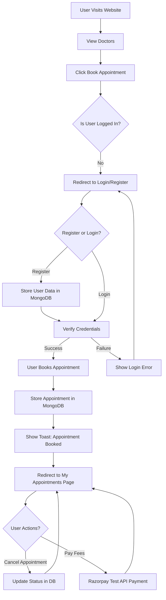

```mermaid
graph TD
  A[User Visits Website] --> B[View Doctors]
  B --> C[Click Book Appointment]
  C --> D{Is User Logged In?}

  D -- No --> E[Redirect to Login/Register]
  E --> F{Register or Login?}
  F -- Register --> G[Store User Data in MongoDB] --> H[Verify Credentials]
  F -- Login --> H

  H -- Success --> I[User Books Appointment]
  H -- Failure --> J[Show Login Error] --> E

  I --> K[Store Appointment in MongoDB]
  K --> L[Show Toast: Appointment Booked]
  L --> M[Redirect to My Appointments Page]

  M --> N{User Actions?}
  N -- Cancel Appointment --> O[Update Status in DB] --> M
  N -- Pay Fees --> P[Razorpay Test API Payment] --> M
```
